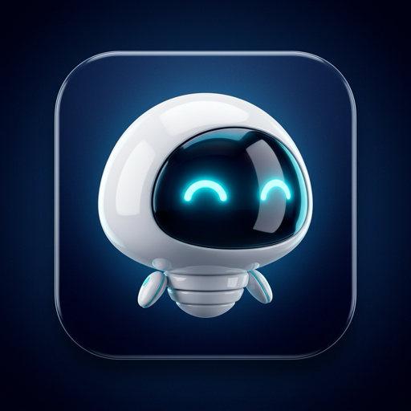
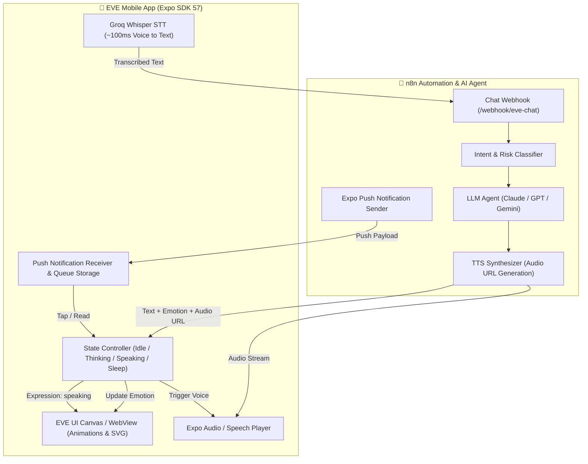
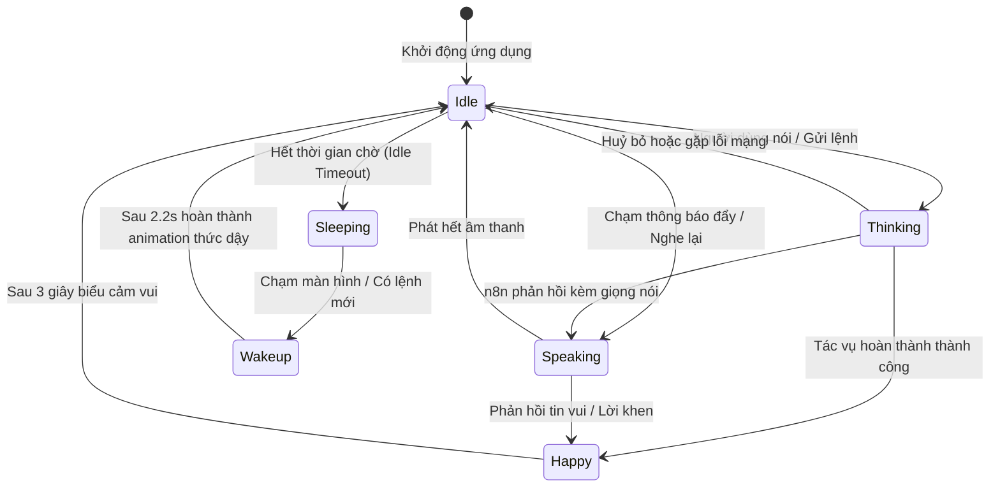

# 🤖 EVE Mobile Voice AI Assistant

<p align="center">
  
</p>

<p align="center">
  <b>Trợ lý di động giọng nói 2 chiều kết nối bộ não n8n AI Agent & Avatar Robot biểu cảm sinh động</b>
</p>

<p align="center">
  
  
  
  
  
</p>

---

## 📌 1. Tổng quan Dự án (Project Overview)

**EVE Mobile Voice AI Assistant** là ứng dụng di động thông minh tích hợp sâu với **n8n AI Agent**, mang đến trải nghiệm trợ lý ảo rảnh tay (hands-free) với hình tượng Robot EVE mang phong cách tương lai (Futuristic Cyberpunk Neon Cyan).

### Các trụ cột hoạt động cốt lõi:
1. **Thông báo chủ động bằng Giọng nói (Proactive Voice Push Notification)**: Khi n8n ghi nhận sự kiện/cảnh báo từ hệ thống giám sát hoặc tự động hóa, thông báo đẩy (Push Notification) sẽ gửi đến điện thoại. Khi người dùng mở ứng dụng, EVE tự động kích hoạt trạng thái `speaking` và đọc toàn bộ nội dung thông báo bằng giọng nói tự nhiên.
2. **Ra lệnh & Giao tiếp giọng nói 2 chiều (Voice-to-Voice AI Interaction)**: Người dùng tương tác trực tiếp qua micro với độ trễ siêu thấp (Groq Whisper STT ~100ms). n8n AI Agent phân tích ý định (Intent), truy vấn ngữ cảnh và phản hồi bằng câu thoại kèm biểu cảm cảm xúc tương ứng.
3. **Cơ chế Xác nhận 2 bước (Two-Step Confirmation)**: Đối với các tác vụ quan trọng (sửa đổi dữ liệu, tài chính, kích hoạt luồng tự động hóa nhạy cảm), EVE sẽ hỏi lại và yêu cầu người dùng xác nhận bằng giọng nói ("Đồng ý" / "Hủy") trước khi n8n thực thi.

---

## ✨ 2. Tính năng Nổi bật (Key Features)

### 🤖 Robot Avatar Sống Động (6 Trạng thái Biểu cảm Canvas 60fps)
Giao diện EVE được mô phỏng mượt mà qua WebView Canvas với đồ họa Neon SVG:
- `idle`: Trạng thái chờ, chớp mắt tự nhiên theo chu kỳ 3–6s.
- `happy`: Vui mừng, cười khúc khích (`giggle-anim`), tay vẫy chào.
- `thinking`: Xoa cằm suy nghĩ (`rub-chin-anim`), visor trượt xuống kèm bong bóng `?`.
- `speaking`: Mắt mở to, co giãn linh hoạt theo biên độ sóng âm giọng nói.
- `sleeping`: Mắt nhắm, hào quang phát sáng dịu (`aura-pulse`) kèm bong bóng `Zzz`. Tự động kích hoạt khi không tương tác sau thời gian chờ (mặc định 30–90s).
- `wakeup`: Giật mình nảy người nhẹ (`startle`), mắt chớp dấu `!`, vung tay mở rồi trở lại `idle`.

### ⚡ Voice STT Siêu Tốc & TTS Linh Hoạt
- **Speech-to-Text (STT)**: Tích hợp Groq Whisper API cho tốc độ nhận diện giọng nói tiếng Việt chuẩn xác và độ trễ cực thấp (~100ms).
- **Text-to-Speech (TTS)**: Hỗ trợ phát audio sinh động từ URL (ElevenLabs / OpenAI TTS tạo từ n8n) hoặc fallback thông minh qua `expo-speech` nội bộ thiết bị.

### 🔔 Quản lý Thông báo & Hàng đợi Đa Thông báo Thông minh
- **Neon Cyan In-App Card UI**: Thẻ thông báo nổi viền Cyan Neon hiển thị chi tiết tiêu đề, nội dung kèm nút **🔊 Nghe lại thông báo**.
- **Multi-Notification Queue**: Cơ chế hàng đợi lưu đĩa (`@eve_pending_notification_queue`), đọc gộp nhiều thông báo bằng câu mở đầu tự nhiên, liệt kê chuẩn tiếng Việt (*"Một là...", "Hai là..."*) và câu kết thúc thân thiện.
- **Tương thích Expo Go**: Tự động nhận diện môi trường chạy để bảo đảm không gây crash Push Token khi test nhanh trên Expo Go.

---

## 🏗️ 3. Kiến trúc Hệ thống (Architecture)

### Sơ đồ Luồng Tương tác (System Interaction Flow)



### Máy Trạng thái EVE (State Machine)



---

## 📂 4. Cấu trúc Thư mục Dự án (Project Structure)

```text
eve-app/
├── assets/                    # Biểu tượng ứng dụng, ảnh splash, assets tĩnh
├── docs/                      # Tài liệu kỹ thuật chi tiết
│   ├── overview.md            # Mục tiêu, use cases và kịch bản hoạt động
│   ├── architecture.md        # Kiến trúc hệ thống, State Machine, Sequence diagrams
│   ├── api-contracts.md       # Cấu trúc JSON Request / Response với n8n
│   ├── conventions.md         # Quy chuẩn coding, cấu trúc state, xử lý lỗi
│   ├── tasks.md               # Lộ trình phát triển và checklist tính năng
│   ├── n8n_integration_guide.md # Hướng dẫn cài đặt n8n Webhook & Node
│   └── n8n_workflow_template.json # Template mẫu workflow n8n
├── scripts/                   # Scripts bổ trợ (patch expo notifications, build...)
├── src/                       # Mã nguồn chính của ứng dụng
│   ├── components/            # Giao diện UI (EVE Avatar WebView, ControlPanel, StatusBadge...)
│   ├── hooks/                 # Custom React Hooks (useEVEState, useSpeechRecognize...)
│   ├── services/              # Tầng dịch vụ (n8nService, audioService, notificationService...)
│   ├── types/                 # TypeScript interfaces và types
│   └── utils/                 # Các hàm helper xử lý chuỗi, thời gian, hàng đợi
├── App.tsx                    # Entry point chính của ứng dụng React Native
├── CONTEXT.md                 # Tóm tắt ngữ cảnh dành cho AI Agent & Developers
├── eve_robot_interface.html   # Template HTML/CSS/SVG mô phỏng EVE Canvas 60fps
├── app.json                   # Cấu hình Expo App (Permissions, Plugins, Scheme)
├── eas.json                   # Cấu hình EAS Build (Development, Preview, Production)
├── package.json               # Danh sách dependencies và npm scripts
└── tsconfig.json              # Cấu hình TypeScript
```

---

## 🛠️ 5. Tech Stack & Dependencies

| Hạng mục | Công nghệ sử dụng | Mục đích |
|---|---|---|
| **Core Framework** | React Native 0.86 + Expo SDK 57 | Nền tảng ứng dụng di động đa nền tảng (iOS / Android) |
| **Language** | TypeScript 6.0 | Đảm bảo tính an toàn kiểu dữ liệu và cấu trúc code |
| **Avatar Engine** | `react-native-webview` (HTML5/SVG/CSS Keyframes) | Render mượt mà 60fps khuôn mặt và biểu cảm EVE |
| **Speech-to-Text** | Groq Cloud Whisper API | Nhận diện giọng nói siêu nhanh (~100ms) |
| **Audio Playback** | `expo-audio` & `expo-speech` | Phát file âm thanh TTS và fallback giọng đọc hệ thống |
| **Push Notifications**| `expo-notifications` + AsyncStorage | Quản lý token, nhận thông báo đẩy và lưu hàng đợi offline |
| **AI Brain Backend** | n8n Automation Workflows | Bộ não xử lý tác vụ, LLM Agent, tích hợp hệ thống |

---

## ⚙️ 6. Cấu hình Biến Môi trường (.env)

Tạo file `.env` tại thư mục gốc của dự án với các giá trị phù hợp:

```ini
# Endpoint Webhook n8n xử lý hội thoại chính
EXPO_PUBLIC_N8N_WEBHOOK_URL=https://your-n8n-domain.com/webhook/eve-chat

# Endpoint n8n đăng ký Push Token thiết bị
EXPO_PUBLIC_N8N_REGISTER_URL=https://your-n8n-domain.com/webhook/register-device

# Định danh người dùng mặc định
EXPO_PUBLIC_USER_ID=user_default_01

# API Key Groq Whisper nhận diện giọng nói siêu tốc (~100ms)
EXPO_PUBLIC_GROQ_API_KEY=gsk_your_groq_api_key_here

# Thời gian không tương tác tự động chuyển sang sleeping (tính bằng mili-giây, ví dụ: 90000 = 90s)
EXPO_PUBLIC_IDLE_SLEEP_TIMEOUT=90000
```

---

## 🚀 7. Hướng dẫn Cài đặt & Khởi chạy (Getting Started)

### Yêu cầu Tiên quyết
- [Node.js](https://nodejs.org/) (Khuyến nghị phiên bản LTS v20+ hoặc v22+)
- [npm](https://www.npmjs.com/) hoặc [yarn](https://yarnpkg.com/)
- Thiết bị di động đã cài đặt ứng dụng **Expo Go** (Android / iOS) hoặc máy ảo Android Emulator / iOS Simulator.

### Các bước Thực hiện

1. **Clone repository**:
   ```bash
   git clone <repository_url>
   cd eve-app
   ```

2. **Cài đặt thư viện**:
   ```bash
   npm install
   ```
   > *Lưu ý: Quá trình `postinstall` sẽ tự động kích hoạt `scripts/patch-expo-notifications.js` để đảm bảo tương thích ổn định với phiên bản Expo SDK.*

3. **Cấu hình môi trường**:
   - Sao chép và điền thông số Webhook n8n và Groq API Key vào file `.env` như hướng dẫn ở mục 6.

4. **Khởi chạy Metro Bundler**:
   ```bash
   npm start
   ```
   Hoặc chạy theo từng nền tảng cụ thể:
   - **Android**: `npm run android`
   - **iOS**: `npm run ios`
   - **Web**: `npm run web`

5. **Trải nghiệm trên điện thoại**:
   - Mở ứng dụng **Expo Go** trên điện thoại và quét mã QR hiển thị trên Terminal.

---

## 📡 8. Hợp đồng Payload Dữ liệu (API Contract)

### 1. Payload Push Notification gửi từ n8n
```json
{
  "to": "ExponentPushToken[xxxxxxxxxxxxxxxxxxxxxx]",
  "title": "Cảnh báo hệ thống",
  "body": "Có 1 sự kiện quan trọng cần xác nhận.",
  "data": {
    "action": "speak_notification",
    "text": "Anh ơi, em vừa nhận được 1 thông báo từ hệ thống: Cần kiểm tra giao dịch mới.",
    "emotion": "idle",
    "audio_url": "https://your-domain.com/audio/alert.mp3"
  }
}
```

### 2. Request gửi lên n8n Chat Webhook (`POST /webhook/eve-chat`)
```json
{
  "user_id": "user_default_01",
  "session_id": "sess_123456",
  "message": "Báo cáo doanh thu hôm nay thế nào?",
  "timestamp": 1785153600,
  "client_locale": "vi-VN"
}
```

### 3. Response trả về từ n8n
```json
{
  "status": "ok",
  "reply_text": "Dạ hôm nay doanh thu đạt mức 120 triệu đồng ạ!",
  "emotion": "happy",
  "audio_url": "https://your-domain.com/tts/reply.mp3",
  "require_confirm": false
}
```

---

## 📚 9. Tài liệu Tham khảo (Documentation)

Thông tin kiến trúc và triển khai nâng cao có thể xem chi tiết trong thư mục [docs/](file:///Users/namtran/Local%20Apps/eve-app/docs):
- [Tổng quan & Kịch bản Hoạt động (docs/overview.md)](file:///Users/namtran/Local%20Apps/eve-app/docs/overview.md)
- [Kiến trúc & Sơ đồ Hệ thống (docs/architecture.md)](file:///Users/namtran/Local%20Apps/eve-app/docs/architecture.md)
- [Chi tiết Hợp đồng API (docs/api-contracts.md)](file:///Users/namtran/Local%20Apps/eve-app/docs/api-contracts.md)
- [Quy chuẩn Phát triển Code (docs/conventions.md)](file:///Users/namtran/Local%20Apps/eve-app/docs/conventions.md)
- [Hướng dẫn Tích hợp n8n (docs/n8n_integration_guide.md)](file:///Users/namtran/Local%20Apps/eve-app/docs/n8n_integration_guide.md)
- [Workflow mẫu n8n (docs/n8n_workflow_template.json)](file:///Users/namtran/Local%20Apps/eve-app/docs/n8n_workflow_template.json)

---

## 📄 Bản quyền (License)

Dự án được phát triển nội bộ cho mục đích cá nhân hóa trợ lý điều hành thông minh EVE. Mọi quyền được bảo lưu.
