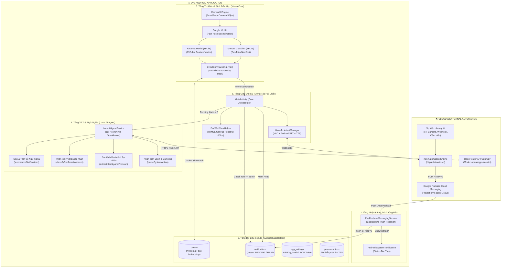

# 🏛️ Kiến Trúc Hệ Thống EVE AI Assistant (System Architecture)

## 📌 1. Tổng Quan Kiến Trúc (Architecture Overview)

Hệ thống **EVE AI Assistant** được xây dựng theo mô hình **Hybrid Edge-Cloud Architecture**, kết hợp giữa:
1. **Edge Computing (On-Device)**: Thị giác máy tính nhận diện khuôn mặt tốc độ cao 30fps, phát hiện giọng nói (VAD), chuyển đổi văn bản thành giọng nói (TTS) và cơ sở dữ liệu SQLite cục bộ.
2. **Local AI Agent (Edge-triggered Cloud LLM)**: Gọi trực tiếp tới mô hình `openai/gpt-4o-mini` qua OpenRouter REST API với độ trễ cực thấp (~300 - 600ms) để xử lý ngữ nghĩa sâu, gộp thông báo và phân loại ý định tiếng Việt.
3. **Cloud Workflow & Automation**: Hệ thống **n8n Automation Engine** xử lý các luồng công việc phức tạp, tích hợp IoT, camera an ninh và đẩy thông báo thời gian thực về thiết bị qua **Firebase Cloud Messaging (FCM)**.

---

## 🧩 2. Sơ Đồ Khối Tổng Thể (System Architecture Diagram)



---

## 🏗️ 3. Phân Tích 5 Tầng Kiến Trúc

### Tầng 1: Tầng Nhận & Hàng Đợi Thông Báo (Notification Layer)
* **`EveFirebaseMessagingService.kt`**:
  - Kế thừa `FirebaseMessagingService`, đăng ký với HĐH Android nhận `com.google.firebase.MESSAGING_EVENT`.
  - Hoạt động nền liên tục, đánh thức ứng dụng khi có tin nhắn FCM ưu tiên cao (`high priority`).
  - Phân tích payload (gồm cả notification thông thường và data payload từ n8n).
  - Tự động sinh `messageId`, ghi nhận thời gian `received_at` và lưu vào bảng `notifications` với trạng thái `is_read = 0`.
  - Khởi tạo Notification Channel `EVE AI Assistant` với độ ưu tiên cao nhất, hiển thị icon EVE và chuông báo.

### Tầng 2: Tầng Cơ Sở Dữ Liệu Cục Bộ (Persistence Layer)
* **`EveDatabaseHelper.kt`** (SQLite Database: `eve_database.db`):
  1. **Bảng `people`**: Lưu trữ hồ sơ người dùng (ID, tên, tuổi, giới tính, đại từ xưng hô, quyền `admin`/`friend`, ảnh đại diện Base64, và mảng nhúng khuôn mặt 192 chiều dạng BLOB).
  2. **Bảng `notifications`**:
     ```sql
     CREATE TABLE notifications (
         id TEXT PRIMARY KEY,
         title TEXT,
         body TEXT,
         data TEXT,
         is_read INTEGER DEFAULT 0,
         received_at INTEGER NOT NULL
     );
     ```
  3. **Bảng `app_settings`**: Lưu trữ key-value an toàn trên máy (API Key OpenRouter, mô hình được chọn, FCM Device Registration Token, Base URL).
  4. **Bảng `pronunciations`**: Lưu trữ quy tắc phát âm riêng biệt để bộ TTS đọc từ ngữ chuẩn xác.

### Tầng 3: Tầng Thị Giác & Sinh Trắc Học (Vision Core Layer)
* **CameraX Engine**: Quản lý vòng đời camera trước/sau, cấu hình `ImageAnalysis.STRATEGY_KEEP_ONLY_LATEST` để không làm chậm luồng đồ họa.
* **ML Kit Face Detection**: Phát hiện vị trí khuôn mặt trong khung hình siêu nhanh (30-40ms).
* **MobileFaceNet (`mobilefacenet.tflite`)**: Trích xuất vector đặc trưng 192 chiều (192-dimensional floating-point vector) chuẩn hóa L2 từ ảnh khuôn mặt đã được căn chỉnh góc xoay Euler-Z.
* **Gender Classifier (`model_gender_q.tflite`)**: Dự đoán giới tính người lạ (Nam/Nữ) để tự động xưng hô "Anh/Chị" lịch sự.
* **MobileFaceNet (`mobilefacenet.tflite`)**: Trích xuất vector đặc trưng 192 chiều (192-dimensional floating-point vector) chuẩn hóa L2 từ ảnh khuôn mặt đã được căn chỉnh góc xoay Euler-Z.
* **Gender Classifier (`model_gender_q.tflite`)**: Dự đoán giới tính người lạ (Nam/Nữ) để tự động xưng hô "Anh/Chị" lịch sự.
* **`EveVisionTracker.kt` (Cơ chế 2-Tier & Quản Lý Vector Thích Ứng)**:
  - **Tier 1 (Định danh đầy đủ & Phân vùng 3 trạng thái)**:
    + $\ge 0.80$: Nhận diện chắc chắn người quen (kèm Consensus check $\ge 2$ góc và Top-2 margin).
    + $[0.65 - 0.79]$: Trạng thái "Ngờ ngợ" -> EVE cất giọng hỏi xác nhận và mở mic chờ câu trả lời.
    + $< 0.65$: Người lạ hoàn toàn -> Chuyển sang luồng chào đón khách mới.
  - **Tier 2 (Bám khung tiết kiệm)**: Khi đã nhận diện đúng người, chuyển sang chế độ theo dõi vị trí khung hình (Bounding Box IoU Tracking) giúp tiết kiệm 70% CPU/GPU.
  - **Quarantine & Rollback**: Toàn bộ vector tự học ngầm trong một phiên được cách ly lưu vết. Nếu người dùng phản bác danh tính (`identity_denied`), hệ thống tự động xóa sạch vector bẩn khỏi SQLite và đặt cooldown 30s.
  - **Nearest Replacement & Moving Average (70/30)**: Khóa cố định Slot 0 (ảnh gốc), tìm slot gần nhất trong các slot 1..8 để hòa trộn vector $70/30$ khi được xác nhận.
  - **Anti-Flicker & Departure Debounce**: Đặt bộ trễ 2.5 giây khi người dùng khuất mặt trước khi phát câu chào tạm biệt để tránh gián đoạn khi quay đầu tạm thời.

### Tầng 4: Tầng Trí Tuệ Ngữ Nghĩa (Local AI Agent Layer)
* **`LocalAiAgentService.kt`**:
  - Sử dụng OkHttpClient kết nối đến OpenRouter API Gateway (`https://openrouter.ai/api/v1/chat/completions`).
  - Mô hình: `openai/gpt-4o-mini`.
  - Phân tích ngữ nghĩa chiều sâu (Deep Semantic Analysis) giải quyết bài toán mà các bộ lọc từ ngữ truyền thống thất bại:
    1. **Gộp & Tóm tắt Ngữ nghĩa**: Đọc toàn bộ danh sách thông báo từ n8n, nhận diện các thông báo khác nhau về mặt câu chữ nhưng cùng chung bản chất sự kiện, gom thành nhóm và tạo bài báo cáo 2-3 câu chuẩn mực tiếng Việt.
    2. **Phân loại Ý định Xác nhận**: Hiểu các câu nói tiếng Việt tự nhiên phức tạp, tiếng lóng, tiếng phủ định kép.
    3. **Trích xuất Danh tính**: Bóc tách tên và đại từ xưng hô tự nhiên.
    4. **Dự phòng An Toàn (Graceful Fallback)**: Nếu mạng chập chờn hoặc timeout (> 4 giây), tự động lùi về thuật toán rule-based nội bộ, đảm bảo hệ thống không bao giờ bị đơ.

### Tầng 5: Tầng Giao Diện & Tương Tác Hai Chiều (Interaction Layer)
* **`EveWebViewHelper.kt` & Canvas HTML5 (`eve_robot_interface.html`)**:
  - Giao diện robot EVE hoạt họa mượt mà 60fps qua WebView.
  - 6 trạng thái cảm xúc chính: `idle`, `happy`, `thinking`, `speaking`, `sleeping`, `wakeup` cùng các cử chỉ `wave-left`, `wave-right`, `spin-360`.
* **`VoiceAssistantManager.kt`**:
  - **Voice Activity Detection (VAD)**: Lắng nghe liên tục, phát hiện khoảng lặng khi người dùng dứt câu để tự động ngắt thu âm.
  - **Barge-in (Ngắt lời tức thì)**: Khi EVE đang nói TTS mà người dùng cất giọng, EVE lập tức im lặng và chuyển sang trạng thái lắng nghe.
  - **Text-to-Speech (TTS)**: Phát âm tiếng Việt chuẩn xác qua Google TTS Engine kết hợp từ điển `TtsNormalizer`.

---

## 📁 4. Bản Đồ Cấu Trúc Mã Nguồn (Codebase Map)

```
face-detector/
├── app/
│   ├── src/main/
│   │   ├── AndroidManifest.xml                  # Cấu hình quyền (CAMERA, RECORD_AUDIO, POST_NOTIFICATIONS) & Service
│   │   ├── google-services.json                 # Cấu hình Firebase Project (eve-agent-7c30d)
│   │   ├── assets/                              # Mô hình AI On-device (TFLite) & Giao diện Robot HTML
│   │   │   ├── eve_robot_interface.html         # Giao diện SVG/Canvas EVE Robot 60fps
│   │   │   ├── mobilefacenet.tflite             # Mô hình trích xuất vector khuôn mặt 192 chiều
│   │   │   └── model_gender_q.tflite            # Mô hình phân loại giới tính
│   │   │
│   │   ├── java/com/example/facedetector/
│   │   │   ├── MainActivity.kt                  # Điều phối viên trung tâm (Camera, Nhận diện, Đọc báo cáo, Dialogs)
│   │   │   ├── ai/
│   │   │   │   ├── LocalAiAgentService.kt       # [MỚI] Local AI Agent (gpt-4o-mini via OpenRouter)
│   │   │   │   ├── EveVisionTracker.kt          # Bộ theo dõi khuôn mặt 2-Tier, khử chớp, chống nhầm lẫn
│   │   │   │   ├── FaceNetModel.kt              # Wrapper TFLite MobileFaceNet
│   │   │   │   ├── GenderClassifier.kt          # Phân loại giới tính Nam/Nữ
│   │   │   │   ├── ImageUtils.kt                # Tiền xử lý ảnh Bitmap, Crop & Xoay góc
│   │   │   │   └── VectorMath.kt                # Tính toán Cosine Similarity, L2 Normalization
│   │   │   │
│   │   │   ├── data/
│   │   │   │   ├── EveDatabaseHelper.kt         # Quản lý SQLite (people, notifications, app_settings)
│   │   │   │   ├── PersonProfile.kt             # Model dữ liệu hồ sơ người dùng
│   │   │   │   └── ByteUtils.kt                 # Chuyển đổi mảng FloatArray <-> BLOB
│   │   │   │
│   │   │   ├── notifications/
│   │   │   │   └── EveFirebaseMessagingService.kt # [MỚI] Background FCM Push Service
│   │   │   │
│   │   │   ├── network/
│   │   │   │   └── N8nService.kt                # Kết nối Webhook n8n (Chat 2 chiều, STT/TTS)
│   │   │   │
│   │   │   ├── voice/
│   │   │   │   ├── VoiceAssistantManager.kt     # Quản lý VAD, Micro STT & TTS
│   │   │   │   └── TtsNormalizer.kt             # Chuẩn hóa văn bản tiếng Việt cho giọng đọc
│   │   │   │
│   │   │   └── ui/
│   │   │       ├── EveWebViewHelper.kt          # Điều khiển biểu cảm Robot qua JavaScript Bridge
│   │   │       └── BoundingBoxOverlay.kt        # Vẽ khung nhận diện lên PiP Camera
│   │   │
│   │   └── res/
│   │       └── layout/
│   │           ├── activity_main.xml            # Giao diện chính (WebView EVE, PiP Camera, Voice Banner)
│   │           └── dialog_settings.xml          # Hộp thoại Cài đặt (Local AI info, Copy FCM Token)
│   │
│   └── build.gradle.kts                         # Cấu hình dependencies (CameraX, ML Kit, TFLite, Firebase BOM)
│
└── docs/                                        # [MỚI] Thư mục tài liệu kiến trúc toàn diện
    ├── README.md                                # Mục lục và tổng quan tài liệu
    ├── SYSTEM_ARCHITECTURE.md                   # Kiến trúc hệ thống và bản đồ mã nguồn
    ├── SYSTEM_FLOWS.md                          # 6 luồng hoạt động chi tiết
    ├── API_CONTRACTS.md                         # Định dạng dữ liệu & Hợp đồng API
    └── SETUP_GUIDE.md                           # Hướng dẫn cài đặt & tích hợp thực tế
```
