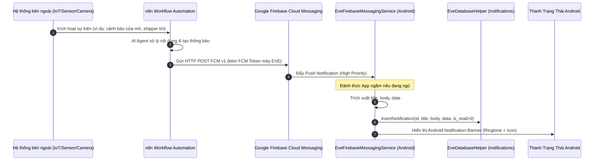
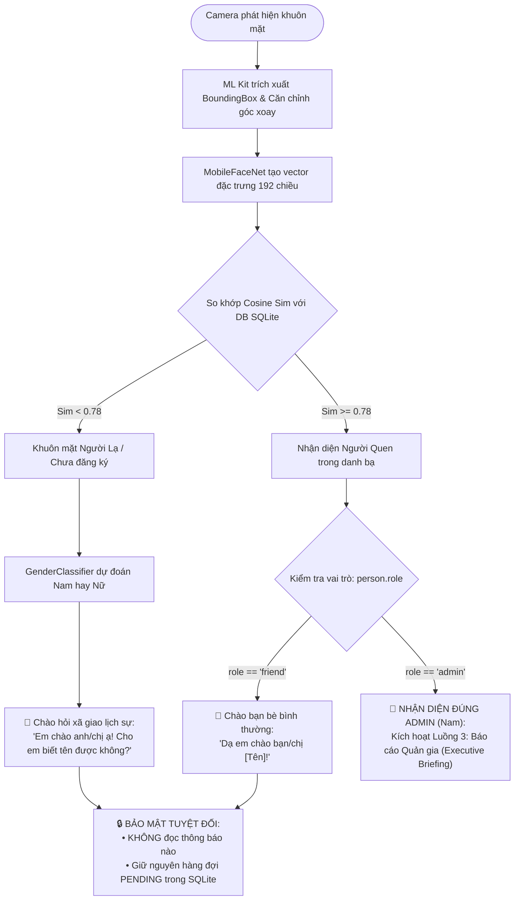
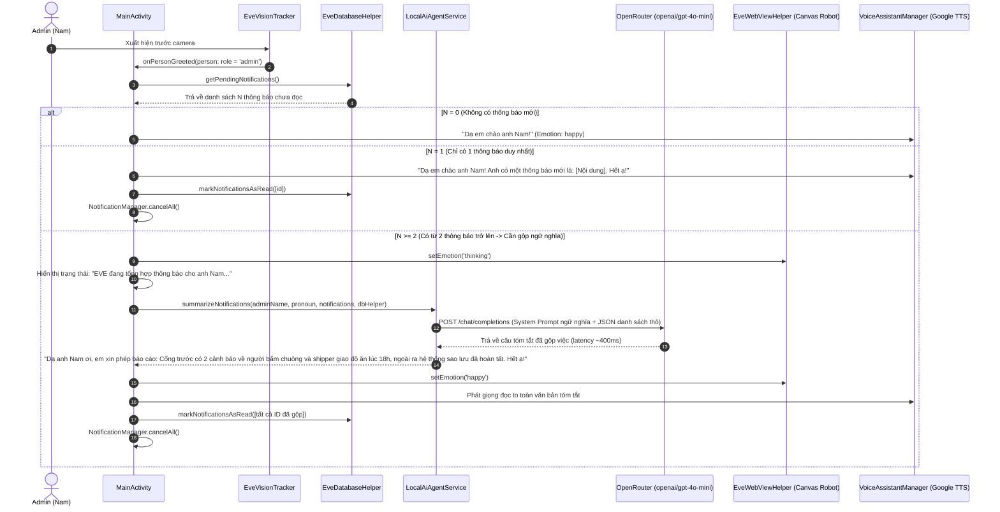
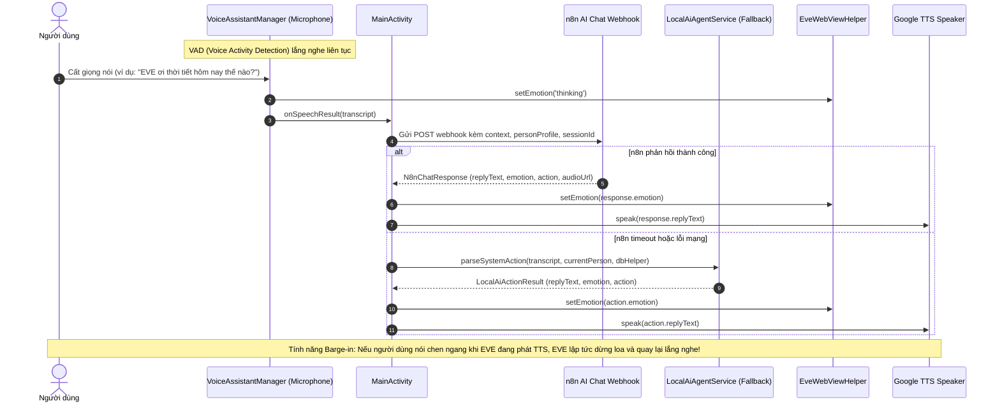
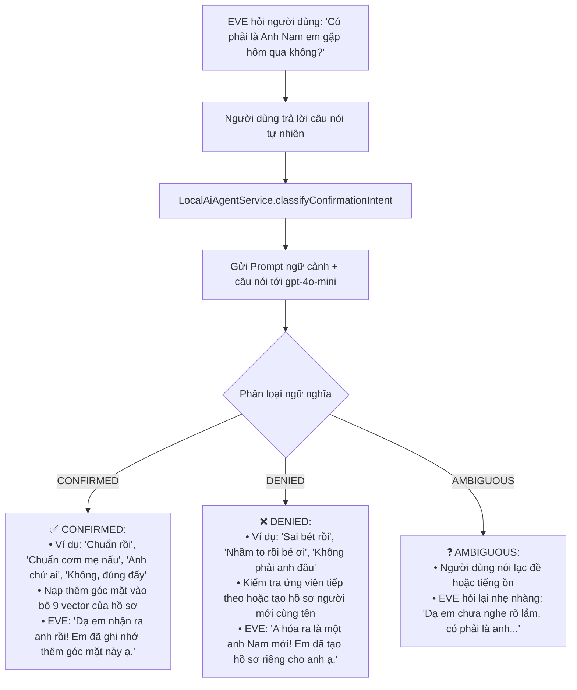

# 🔄 Các Luồng Hoạt Động Cốt Lõi Của Hệ Thống (System Flows)

Tài liệu này mô tả chi tiết 6 luồng hoạt động nghiệp vụ (Business & Technical Flows) của hệ thống **EVE AI Assistant**, bao gồm sơ đồ tuần tự (Sequence Diagram), các điều kiện kích hoạt, cơ chế chuyển trạng thái và cách xử lý ngoại lệ.

---

## 📥 Luồng 1: Nhận Push Notification từ n8n qua FCM & Lưu trữ Hàng Đợi

### Sơ đồ tuần tự:

### Các bước xử lý:
1. Khi có sự kiện (cảm biến phát hiện chuyển động, camera AI nhận diện người lạ, chuông cửa reo, máy chủ quá nhiệt...), n8n sinh ra một thông báo.
2. n8n gọi Firebase Cloud Messaging API v1 đẩy tin nhắn trực tiếp đến FCM Registration Token của máy EVE.
3. `EveFirebaseMessagingService` trên thiết bị Android nhận gói tin ngay cả khi ứng dụng đang đóng hoàn toàn (Cold) hoặc màn hình đang tắt.
4. Thông báo được lưu ngay lập tức vào bảng `notifications` trong SQLite nội bộ với cờ `is_read = 0`.
5. Tạo một System Notification trên thanh trạng thái với PendingIntent trỏ về `MainActivity` (kèm cờ `EXTRA_FROM_NOTIFICATION = true`).

---

## 👁️ Luồng 2: Nhận Diện Khuôn Mặt & Bảo Vệ Bảo Mật Thị Giác (Visual Privacy Gatekeeper)

Đây là cơ chế bảo mật sinh trắc học cốt lõi: **Ai đứng trước camera quyết định EVE được phép nói những gì**.

---

## 👑 Luồng 3: Báo Cáo Quản Gia (Executive Briefing) & Gộp Ngữ Nghĩa Bằng Local AI Agent

Luồng này kích hoạt khi **Admin** xuất hiện trước camera (bất kể Admin mở app từ việc bấm vào Notification hay mở thẳng app trực tiếp từ màn hình chính).

---

## 🎙️ Luồng 4: Đàm Thoại Giọng Nói Hai Chiều (Hands-Free Voice Interaction)

---

## 🤝 Luồng 5: Phân Loại Ý Định Xác Nhận Bằng Ngữ Nghĩa (Semantic Confirmation)

Áp dụng khi hệ thống cần xác nhận người trùng tên (Same-name Disambiguation) hoặc phát hiện xung đột danh tính (Identity Conflict).

---

## 🛡️ Luồng 6: Cơ Chế Dự Phòng An Toàn (Fail-Safe & Offline Mode)

Hệ thống được thiết kế theo nguyên tắc **Zero-Block / Never Crash**:

| Sự cố phát sinh | Cách hệ thống tự động xử lý (Graceful Fallback) |
| :--- | :--- |
| **Mất kết nối Internet khi Admin xuất hiện** | `LocalAiAgentService` phát hiện lỗi kết nối ➔ Lập tức kích hoạt `fallbackLocalNotificationSummary`: EVE tự động đếm số lượng thông báo và liệt kê *"Một là: ... Hai là: ... Hết ạ!"* bằng giọng đọc offline của máy. Không bao giờ bị im lặng. |
| **OpenRouter API hết hạn ngạch hoặc lỗi HTTP 429/500** | Bắt ngoại lệ trong `try-catch`, tự động chuyển sang bộ xử lý nội bộ cục bộ trong vòng 0.1 giây. |
| **n8n Server bảo trì hoặc offline** | Khi người dùng ra lệnh bằng giọng nói, app kích hoạt `LocalAiAgentService.parseSystemAction` để nhận diện các lệnh khẩn cấp (tắt app, cập nhật mặt, cử chỉ) mà không phụ thuộc vào n8n. |
| **Người dùng đứng trước camera nhưng không nói gì (No Speech)** | Lần 1: EVE nhắc nhở nhẹ nhàng: *"Anh hãy nói gì đi, em đang nghe đây ạ"*. Lần 2: EVE hoàn toàn im lặng, tự động dừng mic để không làm phiền người dùng. |
