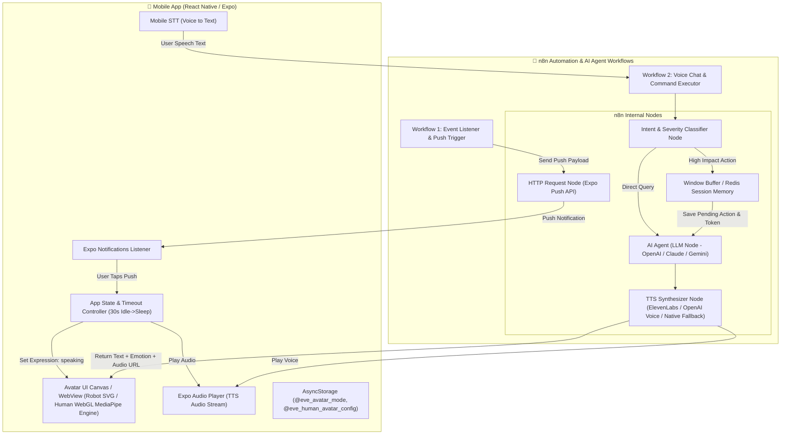
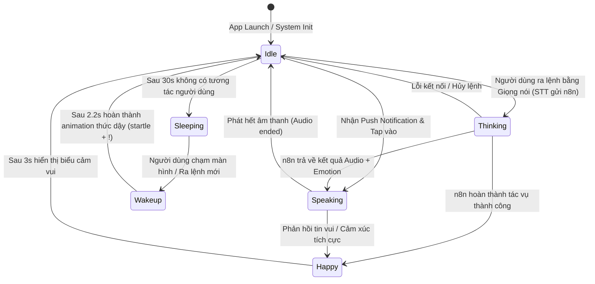
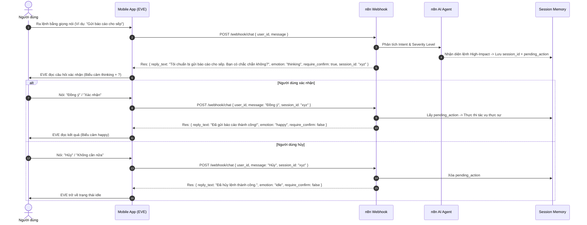

# 2. Kiến trúc Hệ thống (System Architecture) - EVE Mobile Voice AI

## 2.1. Sơ đồ Kiến trúc Tổng quan (System Diagram)



---

## 2.2. Máy Trạng thái Giao diện EVE (UI State Machine)



---

## 2.3. Luồng Xác nhận 2 Bước (Two-Step Confirmation Architecture)



---

## 2.4. Luồng Thông báo Đẩy (Expo Push Notification Workflow)

1. **Khởi tạo Token**: Khi mở App lần đầu, App dùng `expo-notifications` lấy `ExpoPushToken` của thiết bị.
2. **Đăng ký với n8n**: App gửi POST sang n8n `/webhook/register-device` lưu `user_id` và `push_token`.
3. **Trigger Thông báo**: Khi n8n phát hiện sự kiện mới từ hệ thống quản lý, n8n gọi POST tới `https://exp.host/--/api/v2/push/send` với payload:
   ```json
   {
     "to": "ExponentPushToken[xxxxxxxx]",
     "title": "EVE Notification",
     "body": "Có báo cáo mới cần duyệt",
     "data": {
       "action": "speak_notification",
       "audio_url": "https://your-server.com/audio/notif_123.mp3",
       "text": "Có báo cáo doanh thu mới cần duyệt, bạn có muốn xem không?"
     }
   }
   ```
4. **App Response**: Người dùng bấm thông báo -> App bắt `data.audio_url` & `data.text` -> Chuyển EVE sang `speaking` và phát audio ngay lập tức.
