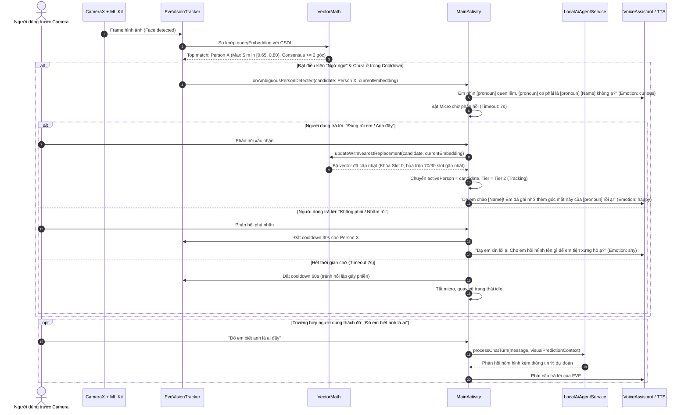

# 📐 Đặc Tả Tính Năng: Xác Nhận Nhận Diện "Ngờ Ngợ" & Cập Nhật Vector Thích Ứng (Nearest Replacement / Moving Average)

- **Mã tính năng**: `FEAT-VISION-AMBIGUOUS-CONFIRM`
- **Phân hệ tác động**: `Vision Core (Tier 1 & 2)`, `Local AI Agent`, `Dialogue Orchestrator (MainActivity)`
- **Trạng thái**: Đã phê duyệt đặc tả (Spec Approved)

---

## 📌 1. Bối Cảnh & Mục Tiêu

### Vấn đề hiện tại:
1. **Khoảng trống nhận diện (Vùng xám $0.65 \le \text{Sim} < 0.80$)**: Khi một người quen đổi kiểu tóc, góc nhìn quá nghiêng hoặc điều kiện ánh sáng yếu khiến điểm tương đồng chỉ đạt $65\% - 79\%$, hệ thống rơi vào trạng thái im lặng không hành động, dẫn tới trải nghiệm AI thiếu tự nhiên.
2. **Bộ nhớ 9 vector bị đóng băng khi đầy**: Khi hồ sơ đạt đủ 9 góc mặt, code cũ ngừng nạp thêm góc mới. Nếu dùng FIFO sẽ xóa mất ảnh gốc (Slot 0), còn nếu xóa góc ít giống nhất sẽ làm mất các góc nghiêng quý hiếm.
3. **Thiếu phản xạ ngữ cảnh trước câu hỏi thách đố**: Khi người dùng hỏi: *"Đố em biết anh là ai đấy?"*, AI Agent không kết nối được thông tin suy đoán thị giác gần nhất để trả lời thông minh.

### Mục tiêu tính năng:
1. Phát hiện trạng thái "ngờ ngợ" dựa trên **ngưỡng $0.65 \le \text{Sim} < 0.80$** kết hợp **Đa góc mặt đồng thuận (Multi-angle Consensus)**.
2. EVE chủ động cất tiếng hỏi xác nhận: *"Em nhìn anh quen lắm, anh có phải là [Danh xưng] [Tên] không ạ?"* và mở mic chờ phản hồi.
3. Triển khai thuật toán **Nearest Replacement / Moving Average**: Khóa Slot 0 (ảnh gốc), tìm slot gần nhất trong các slot còn lại để hòa trộn vector $70/30$.
4. Tích hợp ngữ cảnh suy đoán thị giác (`visualPredictionContext`) vào prompt hội thoại để xử lý sắc sảo câu hỏi thách đố của người dùng.

---

## 🔄 2. Luồng Trải Nghiệm Người Dùng (User Flow)

### 2.1. Sơ đồ tuần tự (Sequence Diagram)



---

## 🧠 3. Chi Tiết Thuật Toán & Công Thức Toán Học

### 3.1. Điều kiện kích hoạt "Ngờ ngợ" (Ambiguity Trigger)
Một đối tượng được coi là "ngờ ngợ" khi thỏa mãn đồng thời:
1. **Dải điểm tương đồng**:
   $$0.65 \le \max_{i} \big(\text{CosineSim}(V_{\text{query}}, V_i)\big) < 0.80$$
2. **Đa góc mặt đồng thuận (Consensus Check)**:
   Hồ sơ của người đó phải có ít nhất **2 vector khác nhau** trong danh bạ đạt:
   $$\text{CosineSim}(V_{\text{query}}, V_j) \ge 0.60 \quad (j \ne i)$$
   *(Tránh việc người lạ vô tình có 1 góc mặt ăn may tiệm cận 0.65)*.
3. **Ổn định thời gian (Temporal Stability)**:
   Đạt điều kiện trên liên tục trong **tối thiểu 3 khung hình liên tiếp** ($\sim 100\text{ms}$).

---

### 3.2. Thuật toán Nearest Replacement & Moving Average

Khi người dùng xác nhận **ĐÚNG**:

```
Đầu vào: 
  - V_new (Vector 192 chiều trích xuất từ khung hình hiện tại)
  - Profile P có danh sách vector: [V_0, V_1, ..., V_{k-1}]  (k <= 9)

Thuật toán:
1. NẾU k < 9:
     V_new được kiểm tra độ đa dạng: nếu max_sim(V_new, V_i) < 0.94:
       Thêm V_new vào cuối danh sách: P.faceEmbeddings.add(V_new)
       k = k + 1
       
2. NẾU k == 9:
     - Khóa cố định Slot 0: V_0 KHÔNG THAY ĐỔI (Anchor Vector).
     - Với các slot từ 1 đến 8:
         Tìm slot index j* sao cho:
         j* = argmax_{j \in [1..8]} ( CosineSim(V_new, V_j) )
     - Hòa trộn thích ứng (Adaptive Moving Average 70/30):
         V_blended = 0.70 * V_{j*} + 0.30 * V_new
     - Chuẩn hóa L2-Normalize:
         V_{j*}^{mới} = V_blended / ||V_blended||_2
     - Gán lại: P.faceEmbeddings[j*] = V_{j*}^{mới}
```

---

## 🗄️ 4. Tác Động Database & API Contracts

### 4.1. Database (SQLite)
* **Bảng `people`**: Cấu trúc bảng giữ nguyên không cần migrate schema mới vì trường `face_embeddings` đã lưu dưới dạng `BLOB` đa vector (ByteUtils).
* **Quy ước dữ liệu**:
  - `faceEmbeddings[0]`: Luôn là vector đăng ký ban đầu (Primary Frontal Anchor).
  - `faceEmbeddings[1..8]`: Các vector góc phụ thích nghi qua thời gian.

### 4.2. API / Interface Contracts Mới

#### `VectorMath.kt`
```kotlin
data class AmbiguityMatchResult(
    val person: PersonProfile,
    val maxSimilarity: Float,
    val consensusCount: Int
)

fun checkAmbiguousMatch(
    queryEmbedding: FloatArray,
    people: List<PersonProfile>,
    minThreshold: Float = 0.65f,
    maxThreshold: Float = 0.80f
): AmbiguityMatchResult?

fun blendEmbeddings(
    existingEmbeddings: List<FloatArray>,
    newEmbedding: FloatArray,
    alpha: Float = 0.30f
): List<FloatArray>
```

#### `LocalAiAgentService.kt`
Bổ sung `visualPredictionContext` vào `processChatTurn`:
```kotlin
data class VisualPredictionContext(
    val candidateName: String?,
    val candidatePronoun: String?,
    val similarityPercent: Int,
    val isAmbiguous: Boolean
)
```

---

## 📋 5. Danh Sách Tasks Triển Khai (Roadmap)

- [ ] **Task 1: Math Core**: Viết hàm `checkAmbiguousMatch` và `blendEmbeddings` (Nearest Replacement + Moving Average) trong `VectorMath.kt`.
- [ ] **Task 2: Vision Tracker**: Bổ sung listener `onAmbiguousPersonDetected` và bộ đếm frame ổn định trong `EveVisionTracker.kt`.
- [ ] **Task 3: Confirmation Handler**: Xử lý luồng hỏi và chờ câu trả lời xác nhận (`pendingAmbiguityConfirmation`) trong `MainActivity.kt`.
- [ ] **Task 4: Thách đố Context**: Truyền `visualPredictionContext` vào `LocalAiAgentService.kt` để EVE trả lời các câu hỏi: *"Đố em biết anh là ai"*.
- [ ] **Task 5: Unit Tests**: Viết bộ test kiểm tra thuật toán hòa trộn vector L2-norm và kiểm tra giữ nguyên Slot 0.
