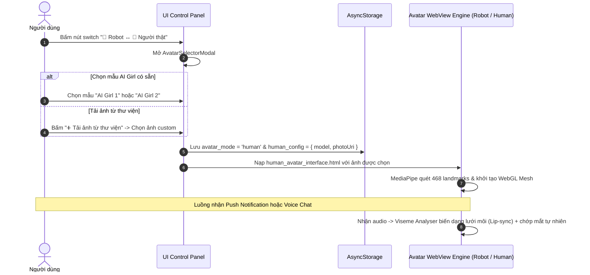

# 📜 Feature Spec: Hybrid Real-Human Talking Avatar (Giao diện Người thật Nói chuyện)

- **Mã tính năng**: `FEAT-HUMAN-AVATAR`
- **Ngày tạo**: 2026-08-09
- **Trạng thái**: Draft / Approved
- **Tác giả**: Senior Solutions Architect

---

## 1. Mô tả Tính năng & Mục tiêu (Feature Overview)

Tính năng **Hybrid Real-Human Talking Avatar** mở rộng giao diện của **EVE Mobile Voice AI Assistant**, cho phép người dùng linh hoạt chuyển đổi giữa **Robot EVE 🤖 (2D Canvas/SVG)** và **Giao diện Người thật 👩 (2.5D WebGL Talking Avatar)**.

### 🌟 Mục tiêu chính:
1. **Trải nghiệm Người thật Chân thật**: Chuyển đổi sang giao diện nhân vật người thật với biểu cảm tự nhiên, chớp mắt, nghiêng đầu và mấp máy môi (Lip-sync) khớp chính xác với âm thanh phát ra khi đọc thông báo hoặc trò chuyện.
2. **Miễn phí 100% & Không độ trễ (0ms Delay)**: Sử dụng kỹ thuật **Client-side WebGL Mesh Deformation** thông qua **Google MediaPipe Face Mesh** kết hợp **Audio Viseme Analyser** trực tiếp trong WebView. Không phụ thuộc GPU Server hay API video đắt đỏ.
3. **Đa dạng Mẫu Nhân vật & Cho phép Custom**: Tích hợp sẵn **2 mẫu AI Girl chuẩn nét** (Trợ lý công sở & Nữ tính năng động), đồng thời cho phép người dùng **tải ảnh người thật tùy chỉnh từ thư viện máy**.
4. **Tương thích 100% với Luồng Hiện tại**: Tương thích hoàn toàn với hệ thống State Machine (`idle`, `speaking`, `happy`, `thinking`, `sleeping`, `wakeup`) và hợp đồng n8n Push Notification / Voice Chat cũ.

---

## 2. Luồng Trải nghiệm Người dùng (User Flow)



---

## 3. UI Layout & Prompt cho Google Stitch

### 3.1. UI Components Mới & Thay đổi
1. **Nút Switch Chế độ (`AvatarSwitchToggle`)**: Đặt trên góc `ControlPanel.tsx` hoặc thanh tiêu đề header, hiển thị icon trạng thái 🤖 Robot / 👩 Người thật.
2. **Modal Chọn Nhân vật (`AvatarSelectorModal.tsx`)**:
   - Thẻ hiển thị **Mẫu 1: Trợ lý Công sở (Office AI Girl)**.
   - Thẻ hiển thị **Mẫu 2: Trẻ trung Năng động (Dynamic AI Girl)**.
   - Nút **`➕ Tải ảnh riêng từ máy`** (tích hợp `expo-image-picker`).
   - Nút toggle chọn chế độ hoạt ảnh (Khớp môi mượt / Khớp môi tối giản).

### 3.2. Stitch Prompt (Google Stitch Design Generation)
```text
Design a sleek dark-mode React Native bottom sheet modal for selecting Voice Assistant Avatars in a futuristic AI app. 
Theme colors: Neon Cyan (#00f0ff), Dark Slate background (#0b0f19), Glassmorphism cards.
Layout features:
- Header title: "Chọn Giao diện Trợ lý EVE" with close button.
- Toggle switch tab: "Robot EVE 🤖" vs "Người thật 👩".
- Avatar grid selection showing 3 cards:
  1. "AI Girl 1 - Trợ lý Công sở" with a realistic AI female portrait, cyan active border glow.
  2. "AI Girl 2 - Năng động" with a vibrant AI female portrait.
  3. "Tải ảnh của bạn" dotted upload card with a large '+' icon and camera label.
- Bottom action button: "Áp dụng Giao diện" with cyan gradient glow.
```

---

## 4. Chi tiết Kỹ thuật Engine WebGL Lip-sync (`human_avatar_interface.html`)

### 4.1. Cấu trúc HTML/JS Engine trong WebView:
- **Thư viện tích hợp**: `@mediapipe/face_mesh` (WASM/JS), `Three.js` / Canvas WebGL.
- **Audio Analyser**: Khởi tạo `AudioContext` & `AnalyserNode` trong WebView khi nhận đường dẫn `audioUrl` hoặc stream âm thanh từ Expo `expo-av`.
- **468 Facial Landmarks Mapping**:
  - Môi ngoài (Outer Lip): Landmark indices `[61, 146, 91, 181, 84, 17, 314, 405, 321, 375, 291]`
  - Môi trong (Inner Lip): Landmark indices `[78, 95, 88, 178, 87, 14, 317, 402, 318, 324, 308]`
  - Mắt trái/mắt phải (Eyes for blinking): indices `[33, 160, 158, 133, 153, 144]`, `[362, 385, 387, 263, 373, 380]`
- **Lip-sync Viseme Curves**:
  - Dựa trên tần số & biên độ âm thanh real-time để điều chỉnh độ mở miệng theo trục Y (`lipOpenY`) và độ rộng miệng theo trục X (`lipWidthX`).

### 4.2. Ánh xạ State Machine Cảm xúc:
- `idle`: Chớp mắt chu kỳ 3.5s, lắc lư nhẹ đầu theo hàm `Math.sin(time)`.
- `speaking`: Co giãn lưới môi theo biên độ âm thanh `analyser.getByteFrequencyData()` + nhướn lông mày nhẹ.
- `happy`: Môi cong nụ cười, mắt khép nhẹ vui vẻ (`eyeScaleY = 0.6`).
- `thinking`: Đầu nghiêng 5 độ, mắt ngước nhẹ sang góc trên.
- `sleeping`: Mắt nhắm hẳn (`eyeScaleY = 0.0`), phủ lớp mờ tối nhẹ 30% alpha.
- `wakeup`: Mắt mở to nhanh, đầu nảy nhẹ 1.5s về `idle`.

---

## 5. Dữ liệu & Lưu trữ (Data & Local Storage Diff)

### Bảng Lưu trữ Local (`AsyncStorage` Keys):
| Key Name | Kiểu dữ liệu | Giá trị Mặc định | Mô tả |
| :--- | :--- | :--- | :--- |
| `@eve_avatar_mode` | `'robot' \| 'human'` | `'robot'` | Chế độ giao diện đang active |
| `@eve_human_avatar_config` | JSON String | `{ "type": "preset", "presetId": "office_girl", "customUri": null }` | Cấu hình nhân vật người thật |

### Hợp đồng API / Push Notification:
- **KHÔNG THAY ĐỔI** (Giữ tương thích 100% với backend n8n).

---

## 6. Danh sách Task Triển khai (Implementation Tasks)

1. **[TASK-01] Tạo Asset & Mẫu AI Girl**: Tạo 2 bức ảnh AI Girl chất lượng cao (1024x1024) và lưu vào `assets/avatars/`.
2. **[TASK-02] Xây dựng Engine `human_avatar_interface.html`**: Viết mã WebGL + Google MediaPipe Face Mesh + Audio Analyser Lip-sync trong HTML5/WebView.
3. **[TASK-03] Tạo Component `AvatarSelectorModal.tsx`**: Xây dựng UI Modal chọn mẫu Avatar & tích hợp `expo-image-picker` để upload ảnh custom.
4. **[TASK-04] Cập nhật `EVEAvatarWebView.tsx`**: Thêm logic hoán đổi giữa `eve_robot_interface.html` và `human_avatar_interface.html` dựa trên `avatar_mode`.
5. **[TASK-05] Cập nhật State & AsyncStorage Hook**: Tích hợp hook `useAvatarMode` để lưu/load cấu hình từ đĩa cứng.
6. **[TASK-06] Kiểm thử & Tối ưu Performance**: Test chuyển đổi mượt mà giữa các chế độ, kiểm tra độ mấp máy môi khi EVE đọc thông báo push từ n8n.
