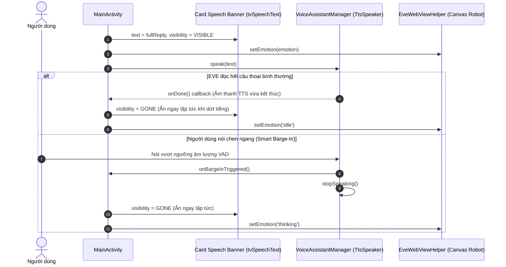
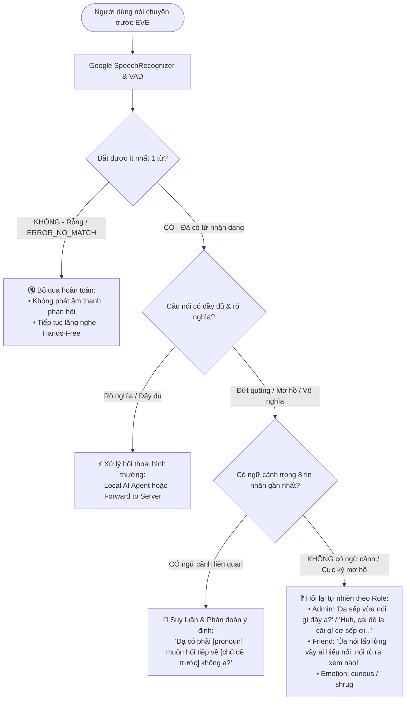

# 📐 Đặc Tả Tính Năng: Quản Lý Vòng Đời Ô Chữ Nói (Speech Banner Lifecycle) & Hỏi Lại/Dự Đoán Ngữ Cảnh Khi Câu Nói Không Rõ Nghĩa

- **Mã tính năng**: `FEAT-VOICE-BANNER-CLARIFICATION`
- **Phân hệ tác động**: `Dialogue Orchestrator (MainActivity)`, `Local AI Agent (LocalAiAgentService)`, `Voice Manager (VoiceAssistantManager)`
- **Trạng thái**: Đã phê duyệt đặc tả (Spec Approved)

---

## 📌 1. Bối Cảnh & Mục Tiêu

### Vấn đề hiện tại:
1. **Ô chứa text câu nói của EVE (`cardSpeechBanner`) bị ẩn đột ngột giữa chừng:**
   - Trong `MainActivity.kt`, code đang cố định thời gian ẩn banner sau đúng 7 giây: `mainHandler.postDelayed(bannerHideRunnable, 7000)`.
   - Với những câu thoại dài (10–20 giây), EVE mới đọc được một nửa thì ô text đã bị biến mất, gây khó chịu và gián đoạn trải nghiệm người dùng.
2. **Xử lý câu nói lấp lửng / không rõ nghĩa / câu nói vô nghĩa chưa tự nhiên:**
   - Khi người dùng nói ngập ngừng, đứt đoạn (ví dụ: *"ơ...", "thế còn...", "hôm nay cái gì cơ..."*) hoặc các từ đệm vô nghĩa: Hệ thống gửi nguyên văn lên mà không có cơ chế liên kết ngữ cảnh gần nhất để suy đoán điều người dùng muốn nói.
   - Chưa có phản xạ hỏi lại dí dỏm, tự nhiên đúng cá tính của EVE (*"Dạ anh vừa nói gì đấy ạ?"*, *"Huh, cái đó là cái gì cơ sếp ơi..."*).
3. **Tiếng ồn ngẫu nhiên làm phát sinh yêu cầu không cần thiết:**
   - Nếu môi trường ồn hoặc người dùng nói lí nhí khiến STT không bắt được từ nào (`ERROR_NO_MATCH`), việc phát ngôn hỏi lại liên tục có thể gây phiền nhiễu.

### Mục tiêu tính năng:
1. **Đồng bộ tuyệt đối vòng đời hiển thị của ô Text với thời lượng giọng đọc TTS:**
   - Ô text hiển thị liên tục trong toàn bộ thời gian EVE đang phát âm thanh câu nói đó.
   - Ẩn ngay lập tức khi âm thanh vừa dứt (qua callback `onDone` của `voiceManager.speak` / `TtsSpeaker`).
   - Ẩn ngay lập tức khi người dùng ngắt lời (Smart Barge-In).
2. **Xử lý thông minh khi câu nói đứt đoạn / mơ hồ / vô nghĩa (Conversational Clarification):**
   - Tận dụng bộ nhớ trượt 8 tin nhắn gần nhất (`sessionConversationHistory`) để suy đoán ý định nếu câu nói trước đó có chủ đề liên quan.
   - Nếu không có ngữ cảnh hoặc câu nói hoàn toàn cụt lủn/vô nghĩa: EVE tự nhiên hỏi lại theo phong cách và vai trò của người đối diện (Admin: ngoan ngoãn, ngơ ngác đáng yêu; Friend: mỉa mai, lém lỉnh; kèm biểu cảm `curious`, `shrug`).
3. **Bỏ qua khi không nhận diện được chữ:**
   - Nếu STT trả về rỗng hoặc `ERROR_NO_MATCH` (không có ít nhất 1 từ có nghĩa): EVE trực tiếp bỏ qua câu nói, không phát tiếng hỏi lại để tránh làm phiền, tiếp tục duy trì lắng nghe Hands-Free.

---

## 🔄 2. Luồng Trải Nghiệm Người Dùng (User Flow)

### 2.1. Sơ đồ tuần tự: Vòng đời Ô Text EVE (Speech Banner)

### 2.2. Sơ đồ quyết định: Phân luồng xử lý câu nói của người dùng

---

## 💻 3. Chi Tiết Thay Đổi Kiến Trúc & Code

### 3.1. `MainActivity.kt` (Quản lý Vòng Đời Ô Chữ)
- **Vị trí**: Hàm `speakAndShowBanner(text: String, emotion: String, onDone: (() -> Unit)? = null)`.
- **Thay đổi**:
  - Xóa bỏ dòng: `mainHandler.postDelayed(bannerHideRunnable, 7000)`.
  - Trong callback hoàn thành của `voiceManager.speak(text) { ... }`:
    - Thêm lệnh ẩn banner ngay lập tức: `binding.cardSpeechBanner.visibility = View.GONE`.
    - Gọi `onDone?.invoke()`.

### 3.2. `LocalAiAgentService.kt` (Bổ sung chỉ dẫn suy luận ngữ cảnh & phong cách hỏi lại)
- **Vị trí**:
  - `buildAdminPrompt`: Bổ sung quy tắc:
    - *Khi câu nói của sếp đứt quãng, ngập ngừng hoặc mơ hồ*:
      - Nếu lịch sử hội thoại gần nhất có chủ đề: Tự động phỏng đoán ý của sếp và hỏi xác nhận (Ví dụ: *"Có phải sếp đang muốn hỏi tiếp về... không ạ?"*).
      - Nếu không có ngữ cảnh hoặc câu nói hoàn toàn vô nghĩa/từ đệm (*"ơ"*, *"hôm nay..."*, *"thế còn..."*, *"huh"*): Hỏi lại ngoan ngoãn, ngơ ngác đáng yêu (*"Dạ sếp vừa nói gì đấy ạ, em chưa nghe rõ?"*, *"Huh, cái đó là cái gì cơ sếp ơi, nói lại em nghe với nha..."* - emotion: `curious` hoặc `shrug`).
  - `buildFriendPrompt`: Bổ sung quy tắc tương tự, cá tính trả treo/lém lỉnh (*"Ủa nói gì lấp lửng vậy trời, nói rõ ra xem nào!"*, *"Huh? Gì cơ, nói rõ hơn coi!"* - emotion: `curious`/`shrug`).
  - `buildStrangerPrompt`: Bổ sung quy tắc lịch sự, nhẹ nhàng (*"Dạ bạn vừa nói gì đấy ạ, mình chưa nghe rõ, bạn nói lại giúp mình với nhé!"*).

### 3.3. `VoiceAssistantManager.kt` (Xử lý `ERROR_NO_MATCH`)
- **Vị trí**: Hàm `onError(error: Int)` trong `RecognitionListener`.
- **Thay đổi**: Khi `error == SpeechRecognizer.ERROR_NO_MATCH` hoặc không có từ nào trong `onResults`: Trực tiếp bỏ qua câu nói, không phát TTS, tự động reset và tiếp tục lắng nghe sau một khoảng nghỉ ngắn.

---

## 🗄️ 4. Thay Đổi Database & API Contracts

- **Database (SQLite)**: Giữ nguyên (Không có thay đổi Schema).
- **API Contracts**: Giữ nguyên format JSON trao đổi giữa Local AI Agent và OpenRouter (`openai/gpt-4o-mini`).

---

## ✅ 5. Kế Hoạch Triển Khai (Tasks Roadmap)

- [ ] **Task 1**: Cập nhật `MainActivity.kt`: Điều chỉnh `speakAndShowBanner` để ẩn ô text ngay lập tức khi TTS `onDone`, loại bỏ timeout 7 giây.
- [ ] **Task 2**: Cập nhật `LocalAiAgentService.kt`: Bổ sung quy tắc dự đoán ngữ cảnh và các mẫu câu hỏi lại hóm hỉnh trong System Prompts (`buildAdminPrompt`, `buildFriendPrompt`, `buildStrangerPrompt`).
- [ ] **Task 3**: Cập nhật `VoiceAssistantManager.kt`: Tinh chỉnh cơ chế bỏ qua khi `ERROR_NO_MATCH` (không có chữ).
- [ ] **Task 4**: Kiểm thử thực tế:
  - Thử đọc một đoạn văn dài 30 từ -> Đảm bảo ô text hiển thị trọn vẹn suốt câu và chỉ ẩn ngay khi dứt tiếng.
  - Thử nói ngập ngừng ("ơ...", "cái gì cơ...") -> Kiểm tra phản xạ hỏi lại và phán đoán ngữ cảnh của EVE.
